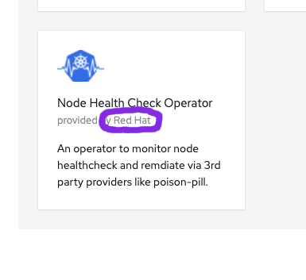

# HA Cockroach DB
- [Prerequisites](#prerequisites)
<!-- - [Test Scenario- Default Install](#default-ocp-install) -->
- [Test Scenario - OCP Install with Node Health Check and Poison Pill](#ocp-with-node-health-check-and-poison-pill)
- [Test Scenario - OCP Install with Machine Health Check and Poison Pill](#ocp-with-machine-health-check-and-poison-pill)
# Prerequisites
_We assume you have an OCP 4.9 Cluster running in AWS._  Next, we want to install the Node Health Check Operator from Red Hat.    


<!-- # Default OCP Install -->

# OCP with Node Health Check and Poison Pill
**Background** We are going to deploy CockroachDB through a StatefulSet where each replica is to be  scheduled on a different node.

**Install CockroachDB**
```
kubectl create ns cockroachdb
helm install cockroachdb -n cockroachdb charts/cockroachdb
```

**Verify Database is Operational**
Insert data into the database
```
kubectl exec -it pod/cockroachdb-0 -n cockroachdb -- cockroach sql --insecure --execute="CREATE TABLE roaches (name STRING, country STRING); INSERT INTO roaches VALUES ('American Cockroach', 'United States'), ('Brownbanded Cockroach', 'United States')"
```

output
```
INSERT 2
```

Read data from the database 
```
kubectl exec -it pod/cockroachdb-1 -n cockroachdb -- cockroach sql --insecure --execute="SELECT * FROM roaches;"
```
output
```
          name          |    country
------------------------+----------------
  American Cockroach    | United States
  Brownbanded Cockroach | United States
(2 rows)


Time: 28ms
```
**Test Scenario - When Node a is lost, poison pill remediation is created and marks the node as Scheduling Disabled**

**Cleanup**
```
helm uninstall cockroachdb -n cockroachdb
```

# OCP with Machine Health Check and Poison Pill
**Background** We are going to deploy CockroachDB through a StatefulSet where each replica is to be  scheduled on a different node.

**Cleanup**
```
helm uninstall cockroachdb -n cockroachdb
```
# Resources
- [Google Doc](https://docs.google.com/document/d/1d4W69xKwLtjhteCi604jl33EDGVaEJJ_2zmzIgeNfuw/edit)